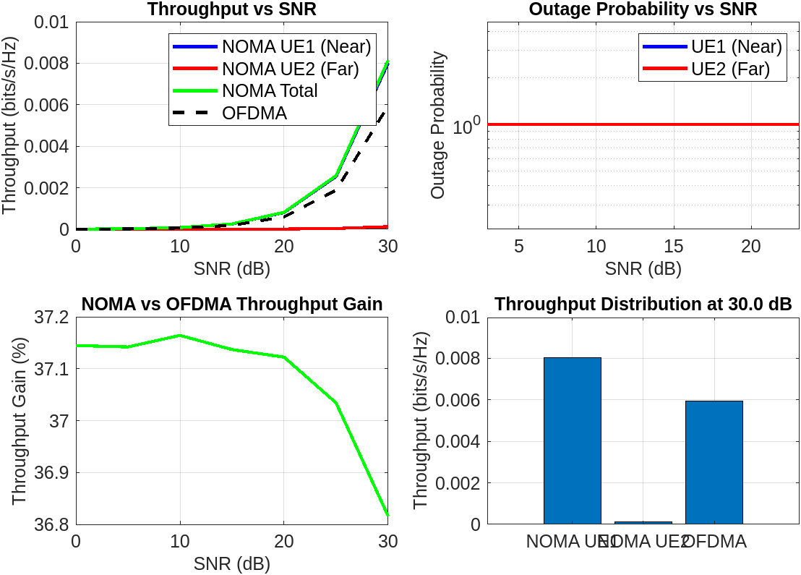

# Mô phỏng NOMA với hai người dùng

## 1. Cơ sở lý thuyết

### 1.1. Tổng quan về NOMA
Non-Orthogonal Multiple Access (NOMA) là một kỹ thuật đa truy cập cho phép nhiều người dùng chia sẻ cùng một tài nguyên tần số và thời gian. Khác với các kỹ thuật đa truy cập truyền thống như OFDMA, NOMA sử dụng sự khác biệt về công suất để phân biệt tín hiệu của các người dùng.

### 1.2. Nguyên lý hoạt động
1. **Phân bổ công suất**: 
   - Người dùng xa (UE1) được phân bổ công suất cao hơn (αP)
   - Người dùng gần (UE2) được phân bổ công suất thấp hơn ((1-α)P)

2. **Quá trình truyền tín hiệu**:
   - Tín hiệu của cả hai người dùng được gửi đồng thời trên cùng một tài nguyên
   - Tín hiệu tổng hợp: x = √(αP)x₁ + √((1-α)P)x₂

3. **Quá trình nhận tín hiệu**:
   - UE1 (xa): Thực hiện SIC để loại bỏ nhiễu từ UE2
   - UE2 (gần): Nhận trực tiếp tín hiệu của mình

### 1.3. Công thức tính toán
1. **SINR cho UE1 (xa)**:
   ```
   SINR₁ = (αP|h₁|²) / ((1-α)P|h₁|² + N₀)
   ```

2. **SINR cho UE2 (gần)**:
   ```
   SINR₂ = ((1-α)P|h₂|²) / N₀
   ```

3. **Throughput**:
   ```
   R = log₂(1 + SINR)
   ```

## 2. Tham số mô phỏng

### 2.1. Tham số cơ bản
- Số lần thực hiện Monte Carlo: 100,000
- Tổng công suất phát: P_total = 1W
- Công suất nhiễu nền: N0_base = 1e-9W

### 2.2. Tham số kênh truyền
- Khoảng cách UE1: d1 = 50m
- Khoảng cách UE2: d2 = 150m
- Hệ số suy hao đường truyền: θ = 3.0

### 2.3. Tham số NOMA
- Hệ số phân bổ công suất: α = 0.7
- Công suất UE1: P1 = αP_total
- Công suất UE2: P2 = (1-α)P_total

### 2.4. Ngưỡng SINR
- Ngưỡng UE1: Γ₁ = 5dB
- Ngưỡng UE2: Γ₂ = 10dB

## 3. Kết quả mô phỏng

### 3.1. Phân tích throughput
- Throughput được tính cho dải SNR từ 0 đến 30dB (bước 5dB)
- So sánh hiệu suất giữa NOMA và OFDMA
- Tính toán throughput trung bình cho từng người dùng

``` 
---------------------------------------------
----- Detailed Throughput Statistics --------
---------------------------------------------

Throughput Statistics by SNR:
SNR_dB   NOMA_UE1     NOMA_UE2     NOMA_Total       OFDMA    Outage_UE1    Outage_UE2
______   ________    __________    __________    __________  __________    __________

 0     8.0585e-06    1.2782e-07    8.1863e-06    5.9691e-06      1             1     
 5       2.56e-05    4.0632e-07    2.6006e-05    1.8963e-05      1             1     
 10    8.1155e-05    1.2767e-06    8.2432e-05    6.0097e-05      1             1     
 15    0.00025548    4.0493e-06    0.00025953    0.00018925      1             1     
 20    0.00080852    1.2782e-05     0.0008213    0.00059895      1             1     
 25     0.0025438    4.0516e-05     0.0025843     0.0018859      1             1     
 30      0.008017    0.00012789     0.0081449     0.0059532      1             1     


Summary Statistics:
Maximum NOMA Throughput: 0.0081 bits/s/Hz at 30.0 dB
Maximum OFDMA Throughput: 0.0060 bits/s/Hz at 30.0 dB
Average Throughput Gain: 37.08%

Statistics have been saved to 'noma_throughput_statistics.csv'
```


### 3.2. Phân tích xác suất outage
- Xác suất outage được tính dựa trên ngưỡng SINR
- Xét đến ảnh hưởng của SIC ở UE1
- Phân tích outage cho cả hai người dùng

### 3.3. Đánh giá hiệu suất
- So sánh tổng throughput của NOMA và OFDMA
- Tính toán độ tăng throughput trung bình
- Phân tích sự ảnh hưởng của các tham số

## 4. Kết luận

### 4.1. Ưu điểm của NOMA
- Tăng hiệu suất phổ tần
- Cải thiện công bằng trong phân phối tài nguyên
- Hỗ trợ nhiều người dùng hơn trong cùng một tài nguyên

### 4.2. Thách thức
- Yêu cầu xử lý tín hiệu phức tạp hơn
- Ảnh hưởng của nhiễu và lỗi SIC
- Cần cân bằng giữa công suất và hiệu suất

### 4.3. Hướng phát triển
- Tối ưu hóa phân bổ công suất
- Cải thiện kỹ thuật SIC
- Tích hợp với các công nghệ mới (MIMO, mmWave) 